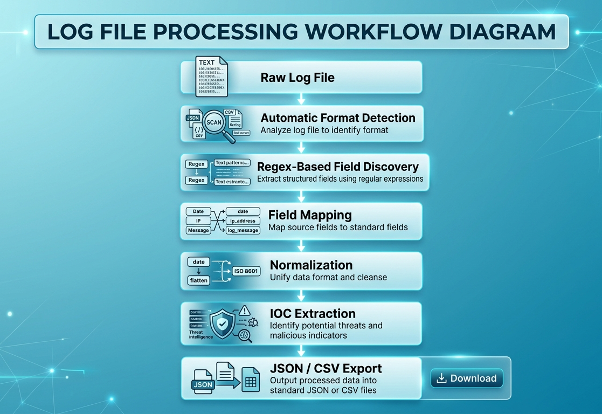
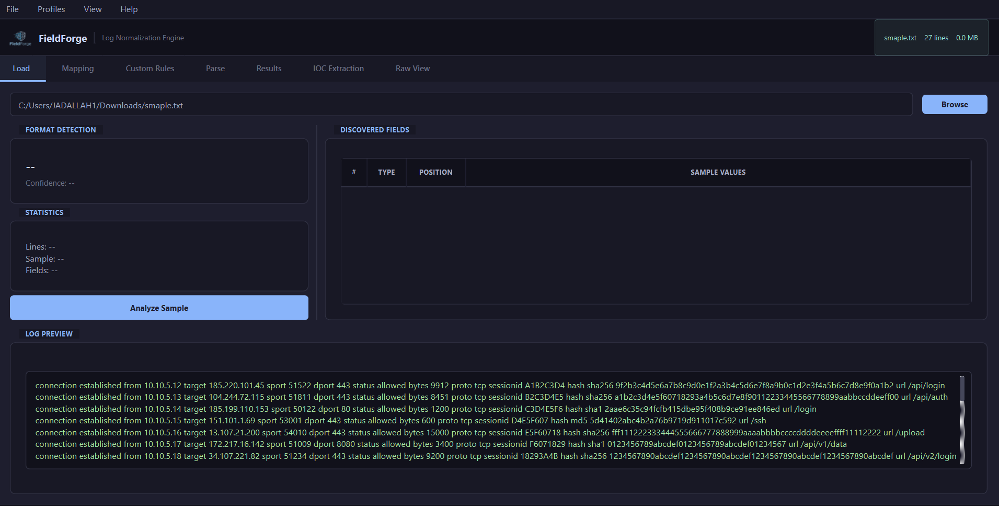
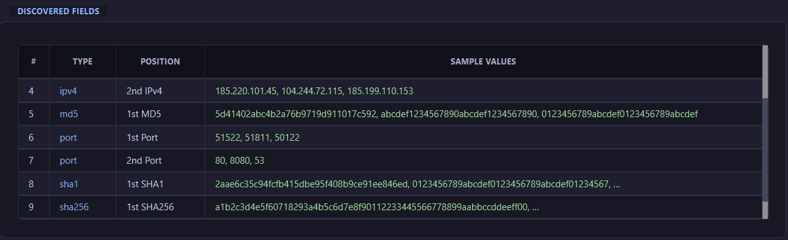
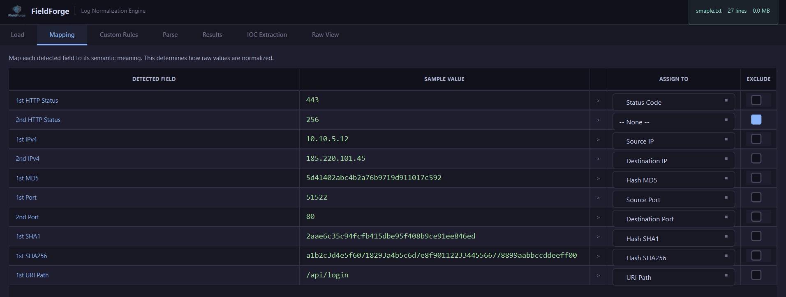
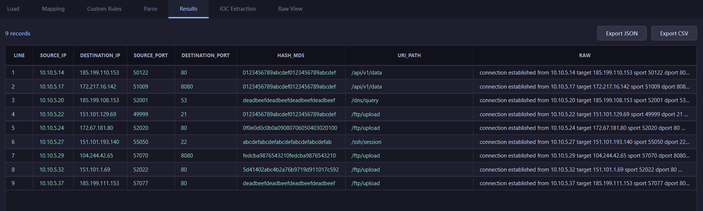
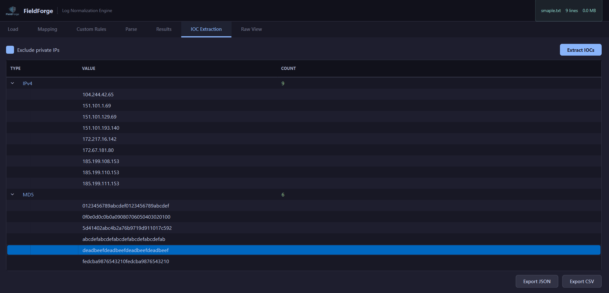
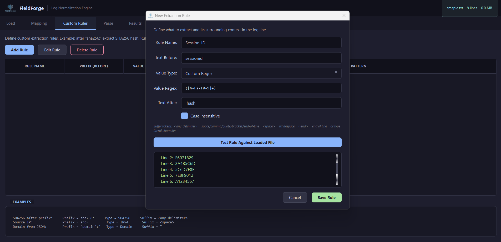

# Behind the Design

FieldForge was created around a simple observation: **security analysts spend far too much time preparing data before they can actually investigate it.**

Every security product produces logs in its own format. Firewalls, IDS/IPS appliances, web servers, operating systems, endpoint agents, cloud services, and custom applications all describe similar events using completely different structures. Even products from the same vendor often change field names or layouts between versions.

Traditional parsers usually expect one specific format. They rely on delimiters, fixed column positions, predefined schemas, or vendor-specific templates. As soon as the format changes, the parser has to be rewritten.

FieldForge approaches the problem differently.

Instead of asking *"What format is this log?"*, it asks:

> **"What information exists inside this line?"**

Every log entry is scanned for recognizable field types such as IP addresses, hashes, timestamps, URLs, usernames, registry paths, ports, file paths, domains, email addresses, HTTP methods, and many more.

Once those values are detected, the analyst decides what each one represents—for example:

* Source IP
* Destination IP
* Destination Port
* Username
* Hash
* Timestamp


This field-centric workflow allows the same engine to normalize completely different log formats without requiring custom parsers for each vendor.

---

# Analysis Workflow

FieldForge follows a straightforward pipeline that mirrors how analysts naturally work with unfamiliar logs.



Each stage is independent, making the workflow transparent and easy to understand.

---

# Step 1 - Load Any Log Source

The analysis begins by loading one or more text-based log files.

Supported inputs include:

* Syslog
* Apache Access Logs
* Nginx Logs
* IIS Logs
* JSON
* NDJSON
* CSV
* TSV
* CEF
* LEEF
* Key=Value Logs
* Windows Event Log exports
* Generic text files

No preprocessing is required.

Simply load the file and start the analysis.



---

# Step 2 - Automatic Format Detection

Before field extraction begins, FieldForge attempts to identify the overall structure of the log.

Examples include:

* JSON
* CSV
* Syslog
* Apache
* Nginx
* IIS
* CEF
* LEEF

Even when the format cannot be identified, FieldForge continues processing using its generic text scanner.

Unknown formats are treated as plain text instead of causing the analysis to fail.

---

# Step 3 - Field Discovery

This is the core of the application.

Instead of splitting lines by commas or spaces, every log line is scanned for known data patterns.

For example:

```
Alert: connection from 10.10.5.21 to 172.16.1.10:443 user=administrator

Detected:

IPv4 #1
IPv4 #2
Port
Username
```

The detection engine currently includes built-in recognizers for:

* IPv4
* IPv6
* SHA256
* SHA1
* MD5
* URLs
* Domains
* Email addresses
* CVEs
* Registry Keys
* File Paths
* URI Paths
* HTTP Methods
* HTTP Status Codes
*Others

Each detector operates independently, allowing multiple field types to be discovered within a single log line.



---

# Step 4 - Field Mapping

Detection only identifies **what exists**.

Mapping defines **what it means**.

For example:

| Detected Field | Analyst Mapping  |
| -------------- | ---------------- |
| IPv4 #1        | Source IP        |
| IPv4 #2        | Destination IP   |
| Port           | Destination Port |
| Username       | Username         |

Any unwanted detections can simply be excluded.

This gives the analyst complete control over the normalization process.



---

# Step 5 - Normalization

After mapping is complete, every log entry is transformed into a structured record.

Regardless of how the original log looked, the output becomes consistent.

Example:

```
Timestamp
Source IP
Destination IP
Destination Port
Username
URL
Hash
...
```

Structured data is significantly easier to:

* Search
* Filter
* Sort
* Export
* Import into other tools



---

# Step 6 - IOC Extraction

Indicators of Compromise are often scattered throughout large log files.

FieldForge automatically groups detected indicators into categories including:

* IP Addresses
* Domains
* URLs
* Email Addresses
* Hashes
* CVEs

The extracted IOC list can then be exported for further investigation or threat intelligence workflows.



---

# Custom Extraction Rules

Built-in detectors cover the most common field types.

However, some applications embed values inside proprietary text.

Example:

```
sha256:9d3f3d8e0f7...
```

Instead of writing new code, analysts can create custom extraction rules.

Rules may specify:

* Text before the value
* Text after the value
* Expected value type

Special helper tokens are also supported, including:

* `<space>`
* `<end>`
* `<any_delimiter>`

This allows FieldForge to adapt to organization-specific log formats without modifying the application itself.



---

# Performance

FieldForge is designed to process large datasets efficiently.

Key implementation details include:

* Native C++20 implementation
* Qt 6 framework
* Multi-threaded parsing
* Background processing
* Responsive interface during analysis
* SQLite-backed profile storage
* PCRE2-powered regular expressions

No external services are required.

Everything runs locally on the analyst's machine.

---

# Privacy by Design

Many log analysis platforms rely on cloud processing.

FieldForge does not.

* No telemetry
* No internet connectivity
* No cloud APIs
* No account creation
* No analytics
* No data collection

Sensitive security logs never leave your environment.

This makes FieldForge suitable for isolated networks, forensic laboratories, and environments where confidentiality is critical.


---

# Who Is It For?

FieldForge is intended for professionals who regularly work with heterogeneous log sources, including:

* Security Operations Center (SOC) Analysts
* Incident Responders
* Digital Forensics Investigators
* Threat Hunters
* Malware Analysts
* Blue Teams
* Penetration Testers
* System Administrators
* Students learning DFIR
* Capture The Flag (CTF) participants

Whether the log comes from a commercial appliance, an open-source service, or a custom application, the objective remains the same:

**Transform unstructured text into consistent, analyzable security data within minutes.**
